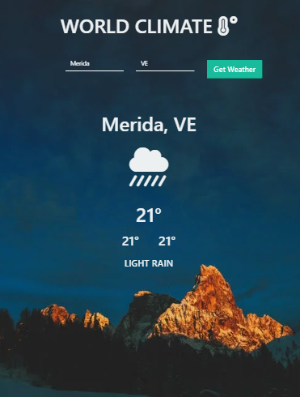

##React-App-Weather

Aplicación para consultar el estado del tiempo en la API de OPENWEATHERMAP implementado en React js.

##Vistas

Imagen de Inicio de la Aplicación.

Imagen de Resultado de la Aplicación.

